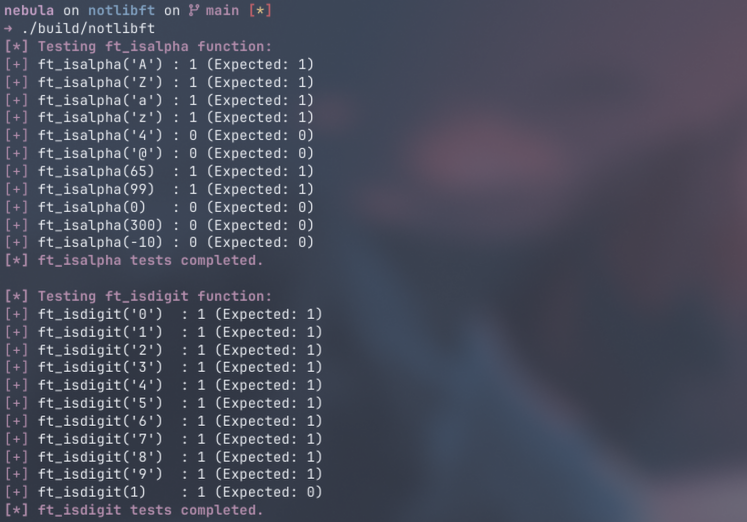

<div align="center">
<h1>notlibft</h1>
<br/>
I'm not an École 42 cadet, but I decided to write my own libft. 
<br/>
<br/>
✨ <em>Because why not?</em> ✨
<br/>
<br/>
</div>

<div align="center">

| Roadmap and learning resources |
| --- |  
| 📑 [Roadmap](./docs/roadmap.md) |
| 📚 [Dive Into Systems: 1. By the C, the Beautiful C](https://diveintosystems.org/book/C1-C_intro/index.html) |
| 📚 [Dive Into Systems: 2. A Deeper Dive into C Programming](https://diveintosystems.org/book/C2-C_depth/index.html)

</div>

## Usage

To run the tests, clone the repository and run `make`: 

```bash
git clone https://github.com/yaxra/notlibft
cd notlibft
make
```
The binary with the tests will be created in the `build` directory, while the library will be created in the `lib` directory. You can then link it to your projects or just run the tests.

> [!NOTE]
> For Windows ~ please note this requires WSL to run the Makefile, or MinGW/Cygwin (with minor adjustments).

## Running Tests
To run the tests, execute the `notlibft` binary in the `build` directory:

<div align="center">



</div>
***

## About
This project is a personal learning exercise. At the end, I'll try to comment the code as much as possible. 

Contributions are not accepted, but feel free to advise me on how to improve it and correct any mistakes I might have made! 🐸


